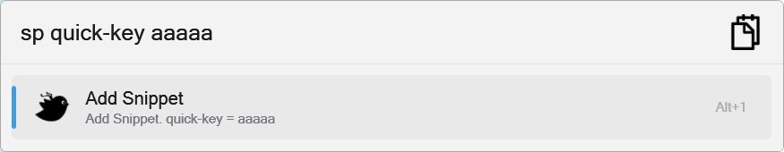
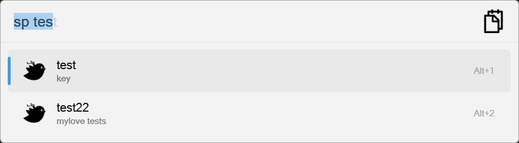
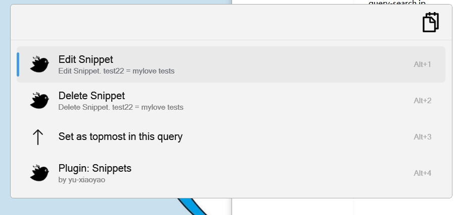

Flow.Launcher.Plugin.Snippets
==================

A plugin for the [Flow launcher](https://github.com/Flow-Launcher/Flow.Launcher).

### Usage

    sp <arguments>

### Interactive Variables (New Feature)

This plugin now supports interactive variables in snippets, allowing you to create dynamic templates that can be customized at runtime.

#### Basic Usage
```
Key: pod down
Value: kubectl scale deploy {app} -n {namespace} --replicas=0

Usage: sp pod down app=frontend namespace=production
Result: kubectl scale deploy frontend -n production --replicas=0
```

#### Features
- **Variable Syntax**: Use `{variable_name}` in your snippet values
- **Runtime Values**: Pass values using `variable=value` format
- **Auto-completion**: Missing variables show helpful suggestions
- **Backward Compatible**: Existing snippets continue to work unchanged

#### Examples
- Database connections: `mysql -h {host} -u {user} -p{password} {database}`
- File operations: `cp {source} {destination}`
- Kubernetes commands: `kubectl get pods -n {namespace} -l app={app}`

For detailed documentation, see [VARIABLES_GUIDE.md](VARIABLES_GUIDE.md)


### Compatibility
> for old flow launcher 1.9.x version, download this release

- [Release v2.0.4](https://github.com/yu-xiaoyao/Flow.Launcher.Plugin.Snippets/releases/tag/v2.0.4)
- [flow.launcher-1.9.x](https://github.com/yu-xiaoyao/Flow.Launcher.Plugin.Snippets/tree/flow.launcher-1.9.x)


### Simple Storage Version
> only support simple json storage snippets.

- [1.x](https://github.com/yu-xiaoyao/Flow.Launcher.Plugin.Snippets/tree/1.x)


### Storage Type
- Flow Launcher Json Setting
  - Default
- Sqlite

>Note: If you want to use Sqlite, you need to change the storage type in the settings. PS: `original data will not be migrated`

#### Change Storage Type Migration
1. export original data
2. change storage type
3. import original data

### Snapshots 

#### Quick Add



#### Query



#### Item Context Menu



#### Snippets Manage


#### Resources

* Icons are from https://icons8.com/icons.
