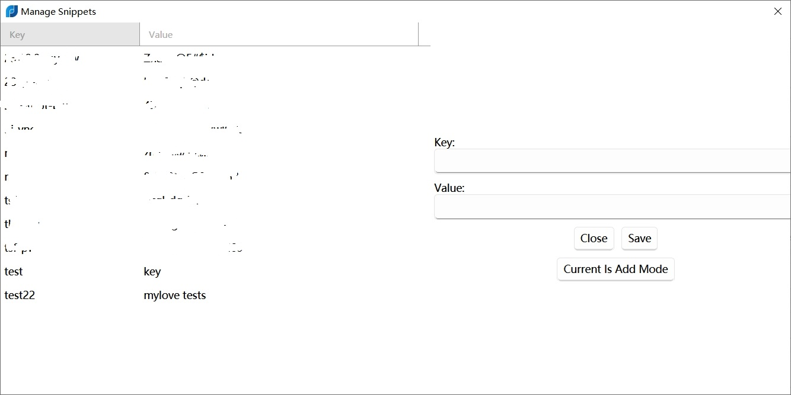

Flow.Launcher.Plugin.Snippets
==================

A plugin for the [Flow launcher](https://github.com/Flow-Launcher/Flow.Launcher).

> `dev` branch support storage mode: `setting.json` or `sqlite database`.

### Usage

    sp <arguments>

### Storage Type
- Flow Launcher Json Setting
  - Default
- Sqlite

>Note: If you want to use Sqlite, you need to change the storage type in the settings. PS: `original data will not be migrated`

#### Change Storage Type Migration
1. export original data
2. change storage type
3. import original data

### Snapshots 

#### Quick Add

#### Query

#### Item Context Menu

#### Snippets Manage

